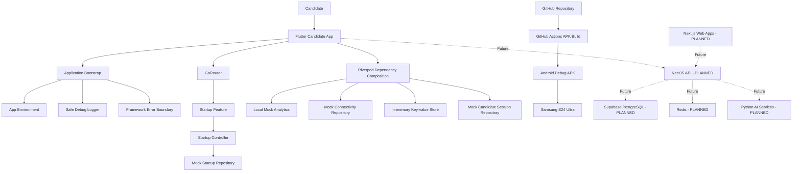

# Current System Block Diagram

```mermaid
flowchart TD
    U[Candidate] --> APP[Flutter Candidate App]

    APP --> BOOT[Application Bootstrap]
    BOOT --> CONFIG[App Environment]
    BOOT --> LOG[Safe Debug Logger]
    BOOT --> ERR[Framework Error Boundary]

    APP --> ROUTER[GoRouter]
    ROUTER --> START[Startup Feature]
    START --> STARTCTRL[Startup Controller]
    STARTCTRL --> STARTREPO[Mock Startup Repository]

    APP --> DI[Riverpod Dependency Composition]
    DI --> ANALYTICS[Local Mock Analytics]
    DI --> CONNECTIVITY[Mock Connectivity Repository]
    DI --> STORAGE[In-memory Key-value Store]
    DI --> SESSION[Mock Candidate Session Repository]

    GH[GitHub Repository] --> ACTIONS[GitHub Actions APK Build]
    ACTIONS --> APK[Android Debug APK]
    APK --> DEVICE[Samsung S24 Ultra]

    API[NestJS API - PLANNED]
    DB[Supabase PostgreSQL - PLANNED]
    REDIS[Redis - PLANNED]
    AI[Python AI Services - PLANNED]
    WEB[Next.js Web Apps - PLANNED]

    APP -. Future .-> API
    API -. Future .-> DB
    API -. Future .-> REDIS
    API -. Future .-> AI
    WEB -. Future .-> API
```
