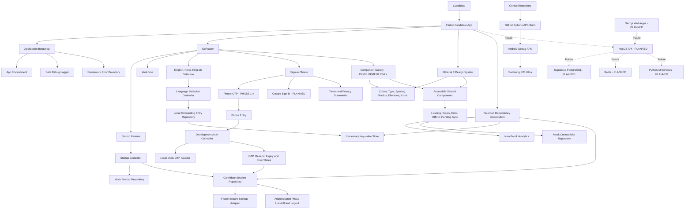

# Current System Block Diagram

```mermaid
flowchart TD
    U[Candidate] --> APP[Flutter Candidate App]

    APP --> BOOT[Application Bootstrap]
    BOOT --> CONFIG[App Environment]
    BOOT --> LOG[Safe Debug Logger]
    BOOT --> ERR[Framework Error Boundary]

    APP --> ROUTER[GoRouter]
    ROUTER --> START[Startup Feature]
    ROUTER --> WELCOME[Welcome]
    ROUTER --> LANGUAGE[English, Hindi, Hinglish Selection]
    ROUTER --> SIGNIN[Sign-in Choice]
    ROUTER --> GALLERY[Component Gallery - DEVELOPMENT ONLY]
    START --> STARTCTRL[Startup Controller]
    STARTCTRL --> STARTREPO[Mock Startup Repository]
    LANGUAGE --> LANGCTRL[Language Selection Controller]
    LANGCTRL --> ENTRYREPO[Local Onboarding Entry Repository]
    ENTRYREPO --> STORAGE
    SIGNIN --> PHONE[Phone OTP - PHASE 1.4]
    SIGNIN --> GOOGLE[Google Sign-in - PLANNED]
    SIGNIN --> POLICY[Terms and Privacy Summaries]
    PHONE --> PHONESCREEN[Phone Entry]
    PHONESCREEN --> AUTHCTRL[Development Auth Controller]
    AUTHCTRL --> MOCKOTP[Local Mock OTP Adapter]
    AUTHCTRL --> OTPSCREEN[OTP, Resend, Expiry and Error States]
    OTPSCREEN --> SESSIONREPO[Candidate Session Repository]
    SESSIONREPO --> SECURESTORE[Flutter Secure Storage Adapter]
    STARTCTRL --> SESSIONREPO
    SESSIONREPO --> AUTHSUCCESS[Authenticated Phase Handoff and Logout]

    APP --> THEME[Material 3 Design System]
    THEME --> TOKENS[Colour, Type, Spacing, Radius, Elevation, Icons]
    THEME --> COMPONENTS[Accessible Shared Components]
    COMPONENTS --> STATES[Loading, Empty, Error, Offline, Pending Sync]
    GALLERY --> TOKENS
    GALLERY --> COMPONENTS

    APP --> DI[Riverpod Dependency Composition]
    DI --> ANALYTICS[Local Mock Analytics]
    DI --> CONNECTIVITY[Mock Connectivity Repository]
    DI --> STORAGE[In-memory Key-value Store]
    DI --> SESSIONREPO

    GH[GitHub Repository] --> ACTIONS[GitHub Actions APK Build]
    ACTIONS --> APK[Android Debug APK]
    APK --> DEVICE[Samsung S24 Ultra]

    API[NestJS API - PLANNED]
    DB[Supabase PostgreSQL - PLANNED]
    REDIS[Redis - PLANNED]
    AI[Python AI Services - PLANNED]
    WEB[Next.js Web Apps - PLANNED]

    APP -. Future .-> API
    API -. Future .-> DB
    API -. Future .-> REDIS
    API -. Future .-> AI
    WEB -. Future .-> API
```
