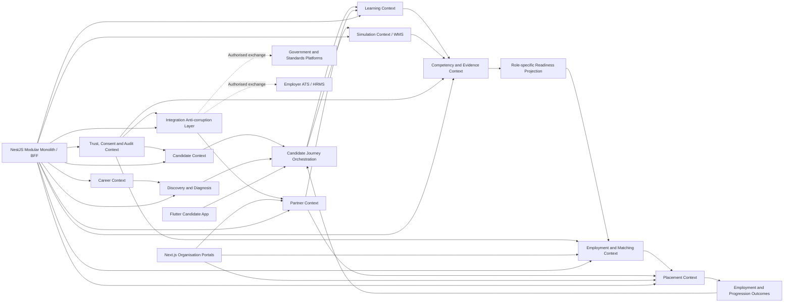

# Current System Block Diagram

```mermaid
flowchart TD
    U[Candidate] --> APP[Flutter Candidate App]

    APP --> BOOT[Application Bootstrap]
    BOOT --> CONFIG[Build-time Environment]
    CONFIG --> LOCALMODE[Secure Local Development Mode]
    CONFIG -->|URL and publishable key| SUPAINIT[Supabase Initialization]
    BOOT --> LOG[Safe Debug Logger]
    BOOT --> ERR[Framework Error Boundary]

    APP --> ROUTER[GoRouter and Protected Navigation]
    ROUTER --> ENTRY[Welcome, Language and Sign-in]
    ROUTER --> ONBOARD[Candidate Onboarding]
    ROUTER --> SHELL[Persistent Five-tab Shell]
    ROUTER --> DIAG[Career Diagnostic]
    ROUTER --> VOICE[Recorded-turn Voice Interview]
    PRACTISE --> WMSCARD[Workplace Simulation Card]
    WMSCARD --> WMSENTRY[WMS Simulation Entry]
    WMSENTRY --> WMSBRIEF[Supervisor Briefing and Acknowledgement]
    WMSBRIEF --> WMSOVERVIEW[Workplace Overview]
    WMSOVERVIEW --> WMSDOC[Document Desk]
    WMSDOC --> WMSDOCK[Receiving Dock]
    WMSDOCK --> WMSINSPECT[Screen 06 Inspection Zone Placeholder]

    ENTRY --> AUTHCTRL[Authentication Controller]
    AUTHCTRL --> LOCALOTP[Development OTP Adapter]
    AUTHCTRL --> SUPAAUTH[Supabase Phone Auth Adapter]
    ONBOARD --> PROFILECTRL[Candidate Profile and Consent Controller]
    PROFILECTRL --> LOCALPROFILE[Secure Local Profile Adapter]
    PROFILECTRL --> SUPAPROFILE[Supabase Profile Adapter]

    SHELL --> HOME[Home]
    SHELL --> LEARN[Learning]
    SHELL --> PRACTISE[Practice]
    SHELL --> JOBS[Jobs]
    SHELL --> ME[Profile and Evidence]
    SHELL --> COACH[Local Scripted Coach]

    DIAG --> INTELCTRL[Candidate Intelligence Controller]
    LEARN --> INTELCTRL
    PRACTISE --> INTELCTRL
    ME --> INTELCTRL
    INTELCTRL --> LOCALINTEL[Encrypted Local State and Pending Sync]
    INTELCTRL --> OFFLINE[Offline-first Supabase Repository]

    DIAG --> DIAGENGINE[Versioned Deterministic Diagnostic Engine]
    DIAGENGINE --> PATHWAY[Explainable Role Gaps and Pathway]
    LEARN --> CONTENT[Versioned Content, Download and Progress]
    PRACTISE --> SIMEVENTS[Ordered Simulation Event Batch]
    SIMEVENTS --> SCORE[Deterministic Scoring]
    SCORE --> EVIDENCE[Competency Evidence]

    WMSCTRL[Workplace Simulation Controller]
    WMSCTRL --> WMSCONTENT[Versioned Local Workplace Content]
    WMSCTRL --> WMSSTATE[Mission State and Action Validation]
    WMSSTATE --> WMSTIMER[Operational Timer Lifecycle]
    WMSSTATE --> WMSAUDIT[Append-only Unscored Attempt Audit]
    WMSSTATE --> WMSDRAFTS[Persisted Document and Count Drafts]
    WMSDRAFTS --> WMSACTIONS[Append-only Scoreable Learner Actions]
    WMSCTRL --> WMSSCENARIO[Deterministic Seeded Scenario]
    WMSCTRL --> WMSSCORE[Scoring, Critical Errors and Remediation]
    WMSSCORE --> WMSEVIDENCE[Versioned Competency Evidence]
    WMSCTRL --> WMSLOCAL[Candidate-owned Encrypted Local Attempts]

    VOICE --> CONSENT[Purpose-separated Voice Consent]
    CONSENT --> MIC[Microphone Permission and Readiness]
    MIC --> TURNS[Local AAC Recorded Turns]
    TURNS --> QUEUE[Resumable Upload Contract and Pending Queue]
    TURNS --> REVIEW[Candidate-reviewed Transcripts]
    REVIEW --> DEVFEEDBACK[Transcript-only Development Evaluation]
    DEVFEEDBACK --> HUMAN[Human Review Required]
    DEVFEEDBACK --> DELETE[Candidate Audio Deletion]

    SUPAAUTH --> JOBSKILLS[(JobSkills Supabase)]
    SUPAPROFILE --> JOBSKILLS
    OFFLINE --> JOBSKILLS
    JOBSKILLS --> RLS[Candidate Ownership RLS]
    JOBSKILLS --> CATALOG[Read-only Published Taxonomy and Content]
    JOBSKILLS --> VOICEDATA[Voice Schema, Prompt and Rubric Registry]
    JOBSKILLS --> PRIVMEDIA[Private Voice Media Bucket]

    APP --> THEME[Material 3 Design System]
    THEME --> ACCESS[Accessible Shared Components]
    ACCESS --> STATES[Loading, Empty, Error, Offline and Pending Sync]
    APP --> ANALYTICS[Local Non-PII Analytics]

    WMSENTRY --> WMSCTRL
    WMSBRIEF --> WMSCTRL
    WMSOVERVIEW --> WMSCTRL
    WMSDOC --> WMSCTRL
    WMSDOCK --> WMSCTRL
    WMSINSPECT --> WMSCTRL

    GH[GitHub Repository] --> ACTIONS[GitHub Actions APK Build]
    ACTIONS --> APK[Signed Android Debug APK]
    APK --> DEVICE[Samsung S24 Ultra]

    API[NestJS BFF - PLANNED]
    REDIS[Redis - PLANNED]
    AI[Python AI Services - PLANNED]
    WEB[Next.js Web Apps - PLANNED]

    QUEUE -. Future signed resumable credentials .-> API
    HUMAN -. Future reviewer workflow .-> API
    APP -. Consequential and privileged operations .-> API
    API -. Future .-> JOBSKILLS
    API -. Future .-> REDIS
    API -. Future .-> AI
    WEB -. Future .-> API
```

## Proposed employability-platform context map

This is a target-state proposal, not a representation of shipped code.

```mermaid
flowchart LR
    CAND[Candidate Context] --> JOURNEY[Candidate Journey Orchestration]
    CAREER[Career Context] --> DISCOVERY[Discovery and Diagnosis]
    DISCOVERY --> JOURNEY
    JOURNEY --> LEARNING[Learning Context]
    JOURNEY --> SIM[Simulation Context / WMS]
    LEARNING --> EVIDENCE[Competency and Evidence Context]
    SIM --> EVIDENCE
    EVIDENCE --> READY[Role-specific Readiness Projection]
    READY --> MATCH[Employment and Matching Context]
    MATCH --> PLACE[Placement Context]
    PLACE --> OUTCOME[Employment and Progression Outcomes]
    OUTCOME --> JOURNEY

    PARTNER[Partner Context] --> LEARNING
    PARTNER --> PLACE
    INTEGRATION[Integration Anti-corruption Layer] --> PARTNER
    INTEGRATION -. Authorised exchange .-> GOV[Government and Standards Platforms]
    INTEGRATION -. Authorised exchange .-> ATS[Employer ATS / HRMS]

    TRUST[Trust, Consent and Audit Context] --> CAND
    TRUST --> EVIDENCE
    TRUST --> MATCH
    TRUST --> INTEGRATION

    MOBILE[Flutter Candidate App] --> JOURNEY
    PORTALS[Next.js Organisation Portals] --> PARTNER
    PORTALS --> MATCH
    PORTALS --> PLACE
    API[NestJS Modular Monolith / BFF] --> CAND
    API --> CAREER
    API --> DISCOVERY
    API --> LEARNING
    API --> SIM
    API --> EVIDENCE
    API --> MATCH
    API --> PLACE
    API --> PARTNER
    API --> INTEGRATION
    API --> TRUST
```
